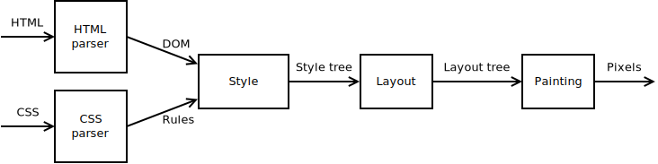

## Part 1: The DOM

- The [DOM](https://dom.spec.whatwg.org) is a tree of nodes. A node has zero or more children. ( It also has various other attributes and methods, but we can ignore most of those for now )

- There are several [Node Types](https://dom.spec.whatwg.org/#dom-node-nodetype), but for now we will ignore most of them and say that a node is either an Element or a Text node. In a language with inheritance these would be subtypes of Node. In Rust they can be an enum (Rust's keyword for a "tagged union" or "sum type"):

- An element includes a tag name and any number of attributes, which can be stored as a map from names to values. Robinson doesn't support namespaces, so it just stores tag and attribute names as simple strings.

## Part 2: HTML
- HTML has its own unique [parsing algorithm](https://html.spec.whatwg.org/multipage/syntax.html#parsing). Unlike parsers for most programming languages and file formats, the HTML parsing algorithm does not reject invalid input. Instead it includes specific error-handling instructions, so web browsers can agree on how to display every web page, even ones that don't conform to the syntax rules. Web browsers have to do this to be usable: Since non-conforming HTML has been supported since the early days of the web, it is now used in a huge portion of existing web pages.

- Here’s an example of HTML source code:
``` html
<html>
    <body>
        <h1>Title</h1>
        <div id="main" class="test">
            <p>Hello <em>world</em>!</p>
        </div>
    </body>
</html>
```
- The following syntax is allowed:
```
    . Balanced tags: <p>...</p>
    . Attributes with quoted values: id="main"
    . Text nodes: <em>world</em>
```
## Part 3: CSS
- introduces code for reading [Cascading Style Sheets (CSS)](https://www.w3.org/TR/CSS2/).

- Here’s an example of CSS source code:
``` css
h1, h2, h3 { margin: auto; color: #cc0000; }
div.note { margin-bottom: 20px; padding: 10px; }
#answer { display: none; }

```
- All other CSS syntax is unsupported, including: 
```
    . @-rules
    . comments
    . any selectors/values/units not mentioned in code
```

- Parsing : 
```
CSS has a straightforward grammar, making it easier to parse correctly than its quirky cousin HTML. When a standards-compliant CSS parser encounters a parse error, it discards the unrecognized part of the stylesheet but still processes the remaining portions. This is useful because it allows stylesheets to include new syntax but still produce well-defined output in older browsers.
```
- Specificity : 
```
Specificity is one of the ways a rendering engine decides which style overrides the other in a conflict. If a stylesheet contains two rules that match an element, the rule with the matching selector of higher specificity can override values from the one with lower specificity.
```
## Part 4: Style
- This module takes DOM nodes and CSS rules as input, and matches them up to determine the value of each CSS property for any given node.

- The pipeline for our toy browser engine will look something like this, after we complete a few more stages :


- In my implementation, each node in the DOM tree has exactly one node in the style tree. But in a more complicated pipeline stage, several input nodes could collapse into a single output node. Or an input node might expand into several output nodes, or be skipped completely. For example, the style tree could exclude elements whose display property is set to 'none'. (Instead I’ll remove these in the layout stage, because my code turned out a bit simpler that way.)